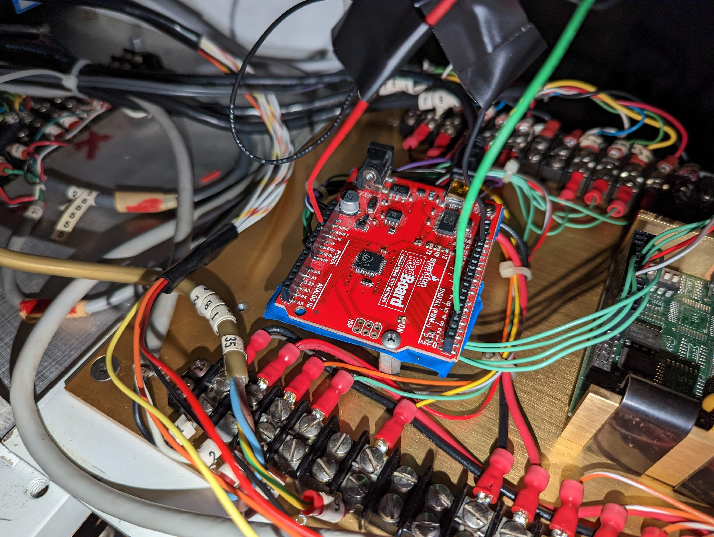
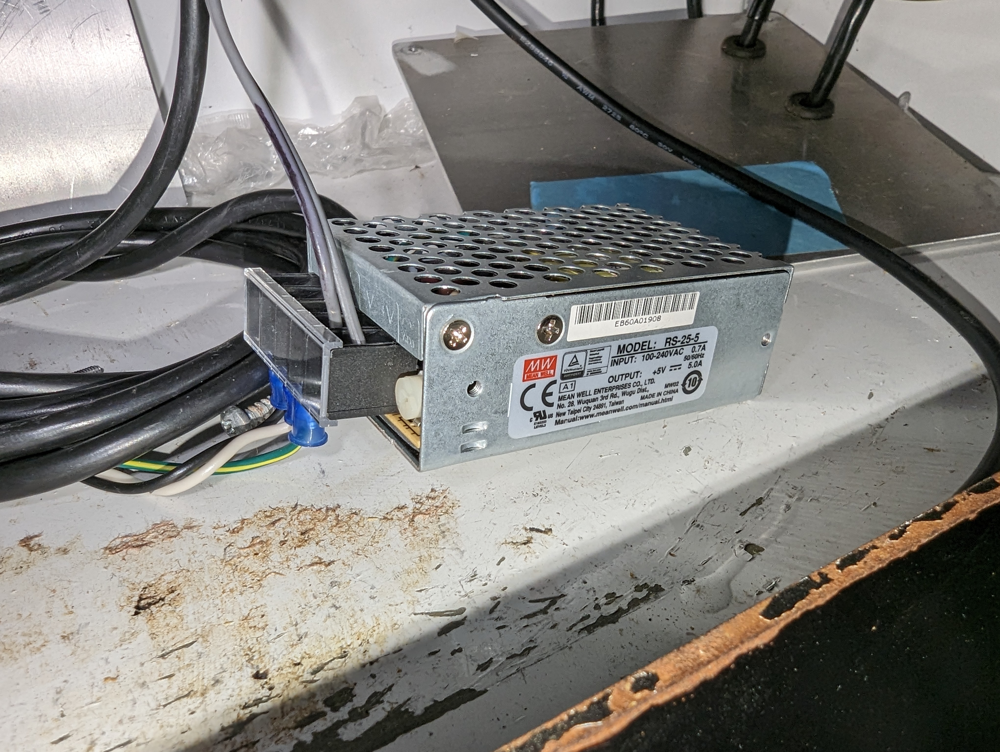
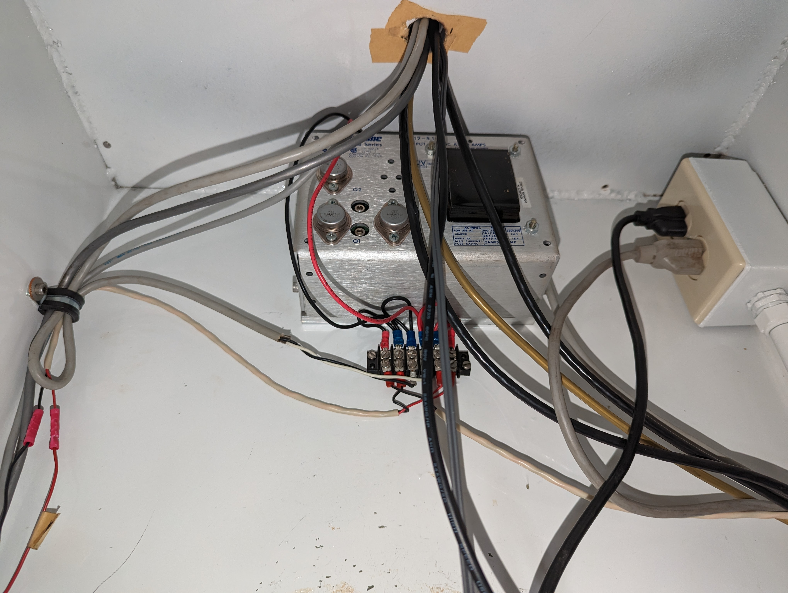
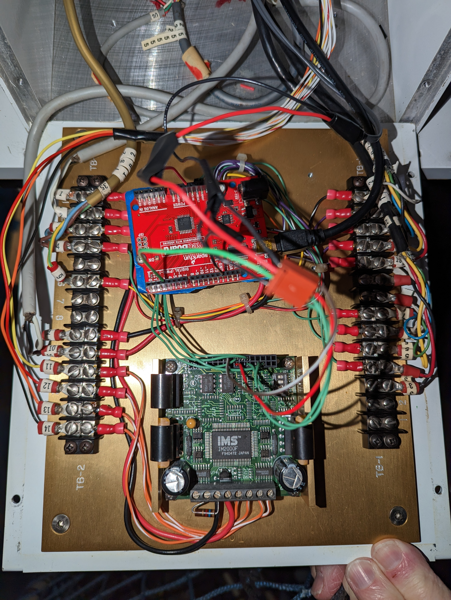
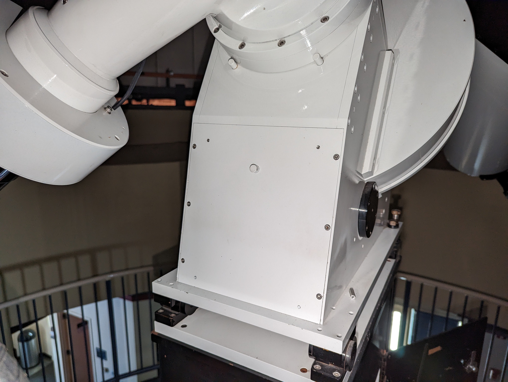

# 2023-01-18 System Overview

This is an overview of how the Telescope was set up from 2018 to 2023

## Arduino

There is an Arduino driving the stepper motor for the equatorial gear. See the scopeDriveTest01 section at [/Code/Arduino/README.md](/Code/Arduino/) for details and pin listing. The scopeDriveTest01 code is what was running on the Arduino from 2018 - 2023.

## Power

There is a Mean Well RS-25-5 +5v power supply in the pedestal supplying the arduino (but not the stepper motor driver board, although there is a shared ground between all of them)

Mean Well power supply:

  

Byers telescope original power supply:

## Equatorial gear stepper motor driver board

The stepper motor driver board (green) is supplied by the main telescope power supply, which is original.

## Accessing the arduino and stepper control board

It is accessed through this panel with a 9/64" allen key:

## Panels and display

None of the panels, switches, external device connectors, or the display is hooked up in this state.